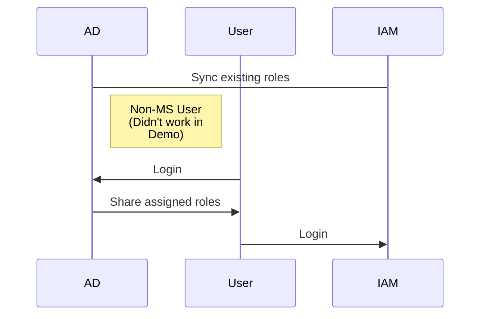

After being asked about the AD<->IAM SAML flow, I realized I was pretty lost on how to explain exactly how it works. I thought I got the general idea: trust established via the shared metadata and the SAML flow, but I didn't understand how IAM roles magically mapped to AD groups, as that task was always done before my involvement in any AWS work.

You can go about it two ways:
AD <- AWS (pull)
https://docs.microsoft.com/en-us/azure/active-directory/saas-apps/amazon-web-service-tutorial 

AWS -> AD (push)
https://aws.amazon.com/blogs/security/how-to-automate-saml-federation-to-multiple-aws-accounts-from-microsoft-azure-active-directory/

AWS SSO: https://aws.amazon.com/blogs/aws/the-next-evolution-in-aws-single-sign-on/